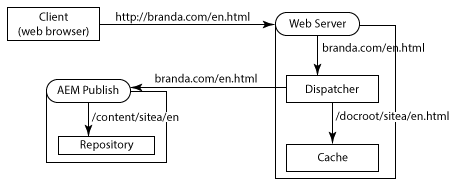
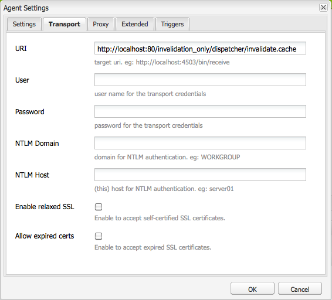
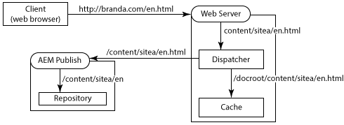
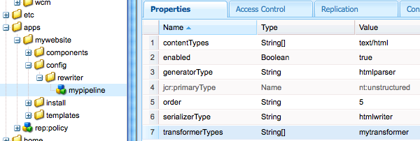

# Använda Dispatcher med flera domäner {#using-dispatcher-with-multiple-domains}

>[!NOTE]
>
>Dispatcher-versionerna är oberoende av AEM. Du kan ha omdirigerats till den här sidan om du har följt en länk till Dispatcher-dokumentationen som är inbäddad i AEM- eller CQ-dokumentationen.

Använd Dispatcher för att bearbeta sidförfrågningar i flera webbdomäner samtidigt som följande villkor stöds:

* Webbinnehåll för båda domänerna lagras i en enda AEM-databas.
* Filerna i Dispatcher-cachen kan ogiltigförklaras separat för varje domän.

Ett företag publicerar till exempel webbplatser för två av sina varumärken: Varumärke A och Varumärke B. Innehållet för webbplatssidorna skapas i AEM och lagras på samma databasarbetsyta:

```
/
| - content  
   | - sitea  
       | - content nodes  
   | - siteb  
       | - content nodes
```

Sidor för `BrandA.com` lagras nedan `/content/sitea`. Klientförfrågningar för URL:en `https://BrandA.com/en.html` returneras den återgivna sidan för `/content/sitea/en` noden. På samma sätt lagras sidor för `BrandB.com` nedan `/content/siteb`.

När du använder Dispatcher för att cachelagra innehåll måste associationer göras mellan sidans URL i klientens HTTP-begäran, sökvägen till motsvarande fil i cachen och sökvägen till motsvarande fil i databasen.

## Klientförfrågningar

När klienterna skickar HTTP-begäranden till webbservern måste URL:en för den begärda sidan matchas mot innehållet i Dispatcher-cachen och slutligen mot innehållet i databasen.


1. Domännamnssystemet upptäcker IP-adressen för webbservern som är registrerad för domännamnet i HTTP-begäran.
1. HTTP-begäran skickas till webbservern.
1. HTTP-begäran skickas till Dispatcher.
1. Dispatcher avgör om de cachelagrade filerna är giltiga. Om det är giltigt skickas de cachelagrade filerna till klienten.
1. Om cachelagrade filer inte är giltiga begär Dispatcher nyligen återgivna sidor från AEM-publiceringsinstansen.

## Cacheinvalidering

När replikeringsagenterna för Dispatcher Flush begär att Dispatcher ogiltigförklarar cachelagrade filer, måste sökvägen till innehållet i databasen matchas mot innehållet i cachen.


1. En sida aktiveras på AEM-författarinstansen och innehållet replikeras till publiceringsinstansen.
1. Dispatcher Flush Agent anropar Dispatcher för att ogiltigförklara cachen för det replikerade innehållet.
1. Dispatcher vidrör en eller flera .stat-filer för att göra de cachelagrade filerna ogiltiga.

Om du vill använda Dispatcher med flera domäner måste du konfigurera AEM, Dispatcher och webbservern. Lösningarna som beskrivs på den här sidan är allmänna och gäller de flesta miljöer. På grund av komplexiteten i vissa AEM-topologier kan din lösning kräva ytterligare anpassade konfigurationer för att lösa vissa problem. Du kommer troligen att behöva anpassa exemplen för att uppfylla din befintliga IT-infrastruktur och hanteringspolicy.

## URL-mappning {#url-mapping}

Om du vill att domän-URL:er och innehållssökvägar ska kunna matcha till cachelagrade filer, måste en filsökväg eller en sidadress översättas vid något tillfälle under processen. Beskrivningar av följande gemensamma strategier tillhandahålls, där översättning av sökväg eller URL sker vid olika tidpunkter i processen:

* (Rekommenderas) I AEM-publiceringsinstansen används Sling-mappning för resursupplösning för att implementera interna regler för URL-omskrivning. Domän-URL:er översätts till sökvägar i innehållsdatabasen. Se [AEM Rewrites Inkommande URL](#aem-rewrites-incoming-urls).
* Webbservern använder interna URL-omskrivningsregler som översätter domän-URL:er till cachelagrade sökvägar. Se [Inkommande URL:er skrivs om på webbservern](#the-web-server-rewrites-incoming-urls).

Det är vanligtvis önskvärt att använda korta URL-adresser för webbsidor. Vanligtvis speglar sid-URL:er strukturen för databasmapparna som innehåller webbinnehållet. URL-adresserna visar dock inte de översta databasnoderna, till exempel `/content`. Klienten är inte nödvändigtvis medveten om strukturen i AEM-databasen.

## Allmänna krav {#general-requirements}

Din miljö måste implementera följande konfigurationer för att ge stöd åt Dispatcher som arbetar med flera domäner:

* Innehåll för varje domän finns i olika grenar av databasen (se exempelmiljön nedan).
* Replikeringsagenten Dispatcher Flush har konfigurerats på AEM-publiceringsinstansen. (Se [Invalidera Dispatcher Cache från en Publishing-instans](page-invalidate.md).)
* Domännamnssystemet tolkar domännamnen med webbserverns IP-adress.
* Dispatcher-cachen speglar katalogstrukturen i AEM-innehållsdatabasen. Filsökvägarna under webbserverns dokumentrot är samma som sökvägarna till filerna i databasen.

## Miljö för de angivna exemplen {#environment-for-the-provided-examples}

De exempellösningar som finns gäller för en miljö med följande egenskaper:

* AEM-författaren och publiceringsinstanserna körs i Linux-system.
* Apache HTTPD är webbservern som körs på ett Linux-system.
* AEM-innehållsdatabasen och dokumentroten på webbservern använder följande filstrukturer (dokumentroten för Apache-webbservern är /`usr/lib/apache/httpd-2.4.3/htdocs)`:

   **Databas**

```
  | - /content  
    | - sitea  
  |    | - content nodes 
    | - siteb  
       | - conent nodes
```

**Webbserverns dokumentrot**

```
  | - /usr  
    | - lib  
      | - apache  
        | - httpd-2.4.3  
          | - htdocs  
            | - content  
              | - sitea  
                 | - content nodes 
              | - siteb  
                 | - content nodes
```

## AEM Rewrites Inkommande URL:er {#aem-rewrites-incoming-urls}

Genom att avbilda resursmatchningar kan du koppla inkommande URL:er till AEM-innehållssökvägar. Skapa mappningar på AEM-publiceringsinstansen så att återgivningsbegäranden från Dispatcher tolkas till rätt innehåll i databasen.

Skickarbegäranden om sidåtergivning identifierar sidan med den URL som den skickas från webbservern. När URL:en innehåller ett domännamn tolkas URL:en till innehållet med Sling-mappningar. I följande bild visas en mappning av `branda.com/en.html` URL:en till `/content/sitea/en` noden.



Dispatcher-cachen speglar databasens nodstruktur. När sidaktiveringar utförs kräver därför de resulterande förfrågningarna om inaktivering av den cachelagrade sidan inga URL- eller sökvägsöversättningar.


## Definiera virtuella värdar på webbservern {#define-virtual-hosts-on-the-web-server}

Definiera virtuella värdar på webbservern så att olika dokumentrotvärden kan tilldelas till varje webbdomän:

* Webbservern måste definiera en virtuell domän för var och en av dina webbdomäner.
* För varje domän konfigurerar du dokumentroten så att den sammanfaller med mappen i databasen som innehåller domänens webbinnehåll.
* Varje virtuell domän måste även innehålla Dispatcher-relaterade konfigurationer, som beskrivs på sidan [Installera Dispatcher](dispatcher-install.md) .

Följande exempelfil konfigurerar `httpd.conf` två virtuella domäner för en Apache-webbserver:

* Servernamnen (som sammanfaller med domännamnen) är branda.com (rad 16) och brandb.com (rad 30).
* Dokumentroten för varje virtuell domän är den katalog i Dispatcher-cachen som innehåller platsens sidor. (raderna 17 och 31)

Med den här konfigurationen utför webbservern följande åtgärder när den tar emot en begäran om `https://branda.com/en/products.html`:

* Associerar URL:en med det virtuella värdsystemet som har `ServerName` en `branda.com.`

* Vidarebefordrar URL:en till Dispatcher.

### httpd.conf {#httpd-conf}

```xml
# load the Dispatcher module
LoadModule dispatcher_module modules/mod_dispatcher.so
# configure the Dispatcher module
<IfModule disp_apache2.c>
 DispatcherConfig conf/dispatcher.any
 DispatcherLog    logs/dispatcher.log  
 DispatcherLogLevel 3
 DispatcherNoServerHeader 0 
 DispatcherDeclineRoot 0
 DispatcherUseProcessedURL 0
 DispatcherPassError 0
</IfModule>

# Define virtual host for brandA.com
<VirtualHost *:80>
  ServerName branda.com
  DocumentRoot /usr/lib/apache/httpd-2.4.3/htdocs/content/sitea
   <Directory /usr/lib/apache/httpd-2.4.3/htdocs/content/sitea>
     <IfModule disp_apache2.c>
       SetHandler dispatcher-handler
       ModMimeUsePathInfo On
     </IfModule>
     Options FollowSymLinks
     AllowOverride None
   </Directory>
</VirtualHost>

# define virtual host for brandB.com
<VirtualHost *:80>
  ServerName brandB.com
  DocumentRoot /usr/lib/apache/httpd-2.4.3/htdocs/content/siteb
   <Directory /usr/lib/apache/httpd-2.4.3/htdocs/content/siteb>
     <IfModule disp_apache2.c>
       SetHandler dispatcher-handler
       ModMimeUsePathInfo On
     </IfModule>
     Options FollowSymLinks
     AllowOverride None
   </Directory>
</VirtualHost>

# document root for web server
DocumentRoot "/usr/lib/apache/httpd-2.4.3/htdocs"
```

Observera att virtuella värdar ärver [DispatcherConfig](dispatcher-install.md#main-pars-67-table-7) -egenskapsvärdet som är konfigurerat i huvudserveravsnittet. Virtuella värdar kan inkludera sin egen DispatcherConfig-egenskap för att åsidosätta huvudserverkonfigurationen.

### Konfigurera Dispatcher för att hantera flera domäner {#configure-dispatcher-to-handle-multiple-domains}

Om du vill ha stöd för URL:er som innehåller domännamn och motsvarande virtuella värdar definierar du följande Dispatcher-grupper:

* Konfigurera en Dispatcher-servergrupp för varje virtuellt värdsystem. Dessa grupper bearbetar begäranden från webbservern för varje domän, söker efter cachelagrade filer och begär sidor från återgivningarna.
* Konfigurera en Dispatcher-servergrupp som används för att göra innehåll i cachen ogiltigt, oavsett vilken domän innehållet tillhör. Den här servergruppen hanterar begäranden om filogiltigförklaring från replikeringsagenter för tömning av dispatcher.

### Skapa Dispatcher-servergrupper för virtuella värdar

Servergrupper för virtuella värdar måste ha följande konfigurationer så att URL:erna i klientens HTTP-begäranden tolkas till rätt filer i Dispatcher-cachen:

* Egenskapen är `/virtualhosts` inställd på domännamnet. Med den här egenskapen kan Dispatcher associera servergruppen med domänen.
* Egenskapen ger `/filter` åtkomst till sökvägen för begärande-URL som trunkeras efter domännamnsdelen. För `https://branda.com/en.html` URL:en tolkas sökvägen som `/en.html`så filtret måste tillåta åtkomst till den här sökvägen.

* Egenskapen ställs in på sökvägen till rotkatalogen för domänens platsinnehåll i Dispatcher-cachen. `/docroot` Den här sökvägen används som prefix för den sammanfogade URL:en från den ursprungliga begäran. Dokumentet för `/usr/lib/apache/httpd-2.4.3/htdocs/sitea` leder till exempel `https://branda.com/en.html` till att begäran tolkas till `/usr/lib/apache/httpd-2.4.3/htdocs/sitea/en.html` filen.

Dessutom måste AEM-publiceringsinstansen anges som rendering för det virtuella värdsystemet. Konfigurera andra gruppegenskaper efter behov. Följande kod är en förkortad servergruppskonfiguration för domänen branda.com:

```xml
/farm_sitea  {     
    ...
    /virtualhosts { "branda.com" }
    /renders {
      /rend01  { /hostname "127.0.0.1"  /port "4503" }
    }
    /filter {
      /0001 { /type "deny"  /glob "*" }
      /0023 { /type "allow" /glob "*/en*" }  
      ...
     }
    /cache {
      /docroot "/usr/lib/apache/httpd-2.4.3/htdocs/content/sitea"
      ...
   }
   ...
}
```

### Skapa en Dispatcher-servergrupp för cacheogiltigförklaring

En Dispatcher-servergrupp krävs för att hantera begäranden om att göra cachelagrade filer ogiltiga. Den här servergruppen måste kunna komma åt .stat-filer i dokumentrotkatalogerna för varje virtuellt värdsystem.

Följande egenskapskonfigurationer gör att Dispatcher kan matcha filer i AEM-innehållsdatabasen från filer i cachen:

* Egenskapen är `/docroot` inställd på webbserverns standarddokument. Det här är vanligtvis den katalog där `/content` mappen skapas. Ett exempelvärde för Apache i Linux är `/usr/lib/apache/httpd-2.4.3/htdocs`.
* Egenskapen ger `/filter` åtkomst till filer under `/content` katalogen.

Egenskapen `/statfileslevel`måste vara tillräckligt hög för att .stat-filer ska skapas i rotkatalogen för varje virtuellt värdsystem. Den här egenskapen gör att cacheminnet för varje domän kan ogiltigförklaras separat. I exempelinställningarna `/statfileslevel` skapas .stat-filer i `2` katalogen och i `*docroot*/content/sitea` `*docroot*/content/siteb` katalogen.

Dessutom måste publiceringsinstansen anges som rendering för det virtuella värdsystemet. Konfigurera andra gruppegenskaper efter behov. Följande kod är en förkortad konfiguration för servergruppen som används för att göra cacheminnet ogiltigt:

```xml
/farm_flush {  
    ...
    /virtualhosts   { "invalidation_only" }
    /renders  {
      /rend01  { /hostname "127.0.0.1" /port "4503" }
    }
    /filter   {
      /0001 { /type "deny"  /glob "*" }
      /0023 { /type "allow" /glob "*/content*" } 
      ...
      }
    /cache  {
       /docroot "/usr/lib/apache/httpd-2.4.3/htdocs"
       /statfileslevel "2"
       ...
   }
   ...
}
```

När du startar webbservern visar Dispatcher-loggen (i felsökningsläge) initieringen av alla grupper:

```shell
Dispatcher initializing (build 4.1.2)
[Fri Nov 02 16:27:18 2012] [D] [24974(140006182991616)] farms[farm_sitea].cache.docroot = /usr/lib/apache/httpd-2.4.3/htdocs/content/sitea
[Fri Nov 02 16:27:18 2012] [D] [24974(140006182991616)] farms[farm_siteb].cache.docroot = /usr/lib/apache/httpd-2.4.3/htdocs/content/siteb
[Fri Nov 02 16:27:18 2012] [D] [24974(140006182991616)] farms[farm_flush].cache.docroot = /usr/lib/apache/httpd-2.4.3/htdocs
[Fri Nov 02 16:27:18 2012] [I] [24974(140006182991616)] Dispatcher initialized (build 4.1.2)
```

### Konfigurera delningskarta för resursupplösning {#configure-sling-mapping-for-resource-resolution}

Använd Sling-mappning för resursupplösning så att domänbaserade URL:er kan matcha innehåll på AEM-publiceringsinstansen. Resursmappningen översätter inkommande URL:er från Dispatcher (ursprungligen från klientens HTTP-begäranden) till innehållsnoder.

Mer information om Sling-resursmappning finns i [Mappningar för resursupplösning](https://sling.apache.org/site/mappings-for-resource-resolution.html) i dokumentationen för Sling.

Vanligtvis krävs mappningar för följande resurser, men ytterligare mappningar kan behövas:

* Innehållssidans rotnod (nedan `/content`)
* Den designnod som sidorna använder (nedan `/etc/designs`)
* Mappen `/libs`

När du har skapat mappningen för innehållssidan kan du använda en webbläsare för att öppna en sida på webbservern om du vill identifiera ytterligare obligatoriska mappningar. Leta reda på meddelanden om resurser som inte hittas i filen error.log för publiceringsinstansen. Följande exempelmeddelande anger att en mappning för `/etc/clientlibs` krävs:

```shell
01.11.2012 15:59:24.601 *INFO* [10.36.34.243 [1351799964599] GET /etc/clientlibs/foundation/jquery.js HTTP/1.1] org.apache.sling.engine.impl.SlingRequestProcessorImpl service: Resource /content/sitea/etc/clientlibs/foundation/jquery.js not found
```

>[!NOTE]
>
>Länkkontrolleraromformaren för standardskrivaren för Apache Sling ändrar automatiskt hyperlänkar på sidan för att förhindra brutna länkar. Länkomskrivning utförs dock bara när länkmålet är en HTML- eller HTML-fil. Om du vill uppdatera länkar till andra filtyper skapar du en transformatorkomponent och lägger till den i en pipeline för HTML-omskrivning.

### Exempel på resursmappningsnoder

I följande tabell visas de noder som implementerar resursmappning för domänen branda.com. Liknande noder skapas för `brandb.com` domänen, till exempel `/etc/map/http/brandb.com`. I samtliga fall krävs mappningar när referenser i sidans HTML inte tolkas korrekt i Sling-sammanhanget.

| Nodsökväg | Typ | Egenskap |
|--- |--- |--- |
| `/etc/map/http/branda.com` | sling:mappning | Namn: sling:internalRedirect Type: Strängvärde: /content/sitea |
| `/etc/map/http/branda.com/libs` | sling:mappning | Namn: sling:internalRedirect- <br/>typ: Strängvärde <br/>: /libs |
| `/etc/map/http/branda.com/etc` | sling:mappning |  |
| `/etc/map/http/branda.com/etc/designs` | sling:mappning | Namn: sling:internalRedirect <br/>VType: Strängvärde <br/>: /etc/designs |
| `/etc/map/http/branda.com/etc/clientlibs` | sling:mappning | Namn: sling:internalRedirect <br/>VType: Strängvärde <br/>: /etc/clientlibs |

## Konfigurera replikeringsagenten för utskickstömning {#configuring-the-dispatcher-flush-replication-agent}

Replikeringsagenten för utskickstömning på AEM-publiceringsinstansen måste skicka invalideringsbegäranden till rätt Dispatcher-servergrupp. Om du vill använda en servergrupp som mål använder du egenskapen URI för replikeringsagenten för borttagning av dubbletter (på fliken Transport). Inkludera värdet för den `/virtualhost` egenskap för Dispatcher-servergruppen som har konfigurerats för att göra cachen ogiltig:

`https://*webserver_name*:*port*/*virtual_host*/dispatcher/invalidate.cache`

Om du till exempel vill använda servergruppen i det föregående exemplet är URI:n `farm_flush` `https://localhost:80/invalidation_only/dispatcher/invalidate.cache`.



## Inkommande URL:er skrivs om på webbservern {#the-web-server-rewrites-incoming-urls}

Använd den interna funktionen för URL-omskrivning på webbservern för att översätta domänbaserade URL:er till filsökvägar i Dispatcher-cachen. Klientförfrågningar för `https://brandA.com/en.html` sidan översätts till exempel till `content/sitea/en.html`filen i webbserverns dokumentrot.



Dispatcher-cachen speglar databasens nodstruktur. När sidaktiveringar utförs kräver därför de resulterande förfrågningarna om att den cachelagrade sidan ska bli ogiltig inga URL- eller sökvägsöversättningar.


## Definiera virtuella värdar och skriv om regler på webbservern {#define-virtual-hosts-and-rewrite-rules-on-the-web-server}

Konfigurera följande aspekter på webbservern:

* Definiera ett virtuellt värdsystem för var och en av dina webbdomäner.
* För varje domän konfigurerar du dokumentroten så att den sammanfaller med mappen i databasen som innehåller domänens webbinnehåll.
* För varje virtuell domän skapar du en regel för URL-namnändring som översätter den inkommande URL:en till sökvägen till den cachelagrade filen.
* Varje virtuell domän måste även innehålla Dispatcher-relaterade konfigurationer, som beskrivs på sidan [Installera Dispatcher](dispatcher-install.md) .
* Dispatcher-modulen måste vara konfigurerad att använda den URL som webbservern har skrivit om. (Se `DispatcherUseProcessedURL` egenskapen i [Installera Dispatcher](dispatcher-install.md).)

I följande exempel konfigureras två virtuella värdar för en Apache-webbserver med filen httpd.conf:

* Servernamnen (som sammanfaller med domännamnen) är `brandA.com` (rad 16) och `brandB.com` (rad 32).

* Dokumentroten för varje virtuell domän är den katalog i Dispatcher-cachen som innehåller platsens sidor. (raderna 20 och 33)
* Regeln för URL-omskrivning för varje virtuell domän är ett reguljärt uttryck som prefixerar sökvägen till den begärda sidan med sökvägen till sidorna i cachen. (raderna 19 och 35)
* Egenskapen är `DispatherUseProcessedURL` inställd på `1`. (rad 10)

Webbservern utför till exempel följande åtgärder när den tar emot en begäran med `https://brandA.com/en/products.html` URL:en:

* Associerar URL:en med det virtuella värdsystemet som har `ServerName` en `brandA.com.`
* Skriver om den URL som ska `/content/sitea/en/products.html.`
* Vidarebefordrar URL:en till Dispatcher.

### httpd.conf {#httpd-conf-1}

```xml
# load the Dispatcher module
LoadModule dispatcher_module modules/mod_dispatcher.so
# configure the Dispatcher module
<IfModule disp_apache2.c>
 DispatcherConfig conf/dispatcher.any
 DispatcherLog    logs/dispatcher.log  
 DispatcherLogLevel 3
 DispatcherNoServerHeader 0 
 DispatcherDeclineRoot 0
 DispatcherUseProcessedURL 1
 DispatcherPassError 0
</IfModule>

# Define virtual host for brandA.com
<VirtualHost *:80>
  ServerName branda.com
  DocumentRoot /usr/lib/apache/httpd-2.4.3/htdocs/content/sitea
  RewriteEngine  on
  RewriteRule    ^/(.*)\.html$  /content/sitea/$1.html [PT]
   <Directory /usr/lib/apache/httpd-2.4.3/htdocs/content/sitea>
     <IfModule disp_apache2.c>
       SetHandler dispatcher-handler
       ModMimeUsePathInfo On
     </IfModule>
     Options FollowSymLinks
     AllowOverride None
   </Directory>
</VirtualHost>

# define virtual host for brandB.com
<VirtualHost *:80>
  ServerName brandB.com
  DocumentRoot /usr/lib/apache/httpd-2.4.3/htdocs/content/siteb
  RewriteEngine  on
  RewriteRule    ^/(.*)\.html$  /content/siteb/$1.html [PT]
   <Directory /usr/lib/apache/httpd-2.4.3/htdocs/content/siteb>
     <IfModule disp_apache2.c>
       SetHandler dispatcher-handler
       ModMimeUsePathInfo On
     </IfModule>
     Options FollowSymLinks
     AllowOverride None
   </Directory>
</VirtualHost>

# document root for web server
DocumentRoot "/usr/lib/apache/httpd-2.4.3/htdocs"
```

### Konfigurera en utskicksgrupp {#configure-a-dispatcher-farm}

När webbservern skriver om URL:er kräver Dispatcher en enda servergrupp som definierats enligt [Konfigurera Dispatcher](dispatcher-configuration.md). Följande konfigurationer krävs för stöd av virtuella värddatorer på webbservern och regler för namnbyte av URL:

* Egenskapen måste `/virtualhosts` innehålla ServerName-värden för alla VirtualHost-definitioner.
* Egenskapen måste vara tillräckligt hög för att .stat-filer ska kunna skapas i de kataloger som innehåller innehållsfilerna för varje domän. `/statfileslevel`

Följande exempelkonfigurationsfil baseras på exempelfilen som är installerad med Dispatcher `dispatcher.any` . Följande ändringar krävs för att ge stöd åt webbserverkonfigurationerna för den föregående `httpd.conf` filen:

* Egenskapen gör att Dispatcher hanterar begäranden för `/virtualhosts` domänerna `brandA.com` och `brandB.com` domänerna. (rad 12)
* Egenskapen är `/statfileslevel` inställd på 2, så att lägesfiler skapas i varje katalog som innehåller domänens webbinnehåll (rad 41): `/statfileslevel "2"`

Som vanligt är dokumentroten i cachen densamma som dokumentroten på webbservern (rad 40): `/usr/lib/apache/httpd-2.4.3/htdocs`

### `dispatcher.any` {#dispatcher-any}

```xml
/name "testDispatcher"
/farms
  {
  /dispfarm0
    {  
    /clientheaders
      {
      "*"
      }      
    /virtualhosts
      {
      "brandA.com" "brandB.com"
      }
    /renders
      {
      /rend01    {  /hostname "127.0.0.1"   /port "4503"  }
      }
    /filter
      {
      /0001 { /type "deny"  /glob "*" }
      /0023 { /type "allow" /glob "*/content*" }  # disable this rule to allow mapped content only
      /0041 { /type "allow" /glob "* *.css *"   }  # enable css
      /0042 { /type "allow" /glob "* *.gif *"   }  # enable gifs
      /0043 { /type "allow" /glob "* *.ico *"   }  # enable icos
      /0044 { /type "allow" /glob "* *.js *"    }  # enable javascript
      /0045 { /type "allow" /glob "* *.png *"   }  # enable png
      /0046 { /type "allow" /glob "* *.swf *"   }  # enable flash
      /0061 { /type "allow" /glob "POST /content/[.]*.form.html" }  # allow POSTs to form selectors under content
      /0062 { /type "allow" /glob "* /libs/cq/personalization/*"  }  # enable personalization
      /0081 { /type "deny"  /glob "GET *.infinity.json*" }
      /0082 { /type "deny"  /glob "GET *.tidy.json*"     }
      /0083 { /type "deny"  /glob "GET *.sysview.xml*"   }
      /0084 { /type "deny"  /glob "GET *.docview.json*"  }
      /0085 { /type "deny"  /glob "GET *.docview.xml*"  }      
      /0086 { /type "deny"  /glob "GET *.*[0-9].json*" }
      /0090 { /type "deny"  /glob "* *.query.json*" }
      }
    /cache
      {
      /docroot "/usr/lib/apache/httpd-2.4.3/htdocs"
      /statfileslevel "2"
      /allowAuthorized "0"
      /rules
        {
        /0000  { /glob "*"     /type "allow"  }
        }
      /invalidate
        {
        /0000  {   /glob "*" /type "deny"  }
        /0001 {  /glob "*.html" /type "allow"  }
        }
      /allowedClients
        {
        }     
      }
    /statistics
      {
      /categories
        {
        /html  { /glob "*.html" }
        /others  {  /glob "*"  }
        }
      }
    }
  }
```

>[!NOTE]
>
>Eftersom en enda Dispatcher-servergrupp har definierats kräver Dispatcher Flush-replikeringsagenten på AEM-publiceringsinstansen inga särskilda konfigurationer.

## Skriva om länkar till filer som inte är HTML {#rewriting-links-to-non-html-files}

Om du vill skriva om referenser till filer som har andra tillägg än .html eller .htm skapar du en Sling-omskrivartransformeringskomponent och lägger till den i standardförskrivningsflödet.

Skriv om referenser när resurssökvägar inte löses korrekt i webbserverkontexten. En omformare krävs till exempel när bildgenererande komponenter skapar länkar som /content/sitea/en/products.navimage.png. Den främsta komponenten i [How to Create a Fully Featured Internet Website](https://helpx.adobe.com/experience-manager/6-3/sites/developing/using/the-basics.html) skapar sådana länkar.

Omskrivaren [Sling](https://sling.apache.org/documentation/bundles/output-rewriting-pipelines-org-apache-sling-rewriter.html) är en modul som efterbearbetar Sling-utdata. implementeringar av rewriter-pipeline består av en generator, en eller flera transformatorer och en serialiserare:

* **Generator:** Tolkar Sling-utdataströmmen (HTML-dokument) och genererar SAX-händelser när specifika elementtyper påträffas.
* **Transformator:** Lyssnar efter SAX-händelser och ändrar följaktligen händelsemålet (ett HTML-element). En omskrivarpipeline innehåller noll eller flera omformare. Transformers körs i sekvens och skickar SAX-händelserna till nästa transformator i sekvensen.
* **Serialiserare:** Serialiserar utdata, inklusive ändringar från varje transformator.


### Förberedelse för AEM-standardåterskapande {#the-aem-default-rewriter-pipeline}

AEM använder en standardomskrivare som bearbetar dokument av typen text/html:

* Generatorn tolkar HTML-dokument och genererar SAX-händelser när den påträffar elementen a, img, area, form, base, link, script och body. Generatoraliaset är `htmlparser`.
* Rörledningen innehåller följande transformatorer: `linkchecker`, `mobile`, `mobiledebug`, `contentsync`.. Transformeraren `linkchecker` externaliserar sökvägar till refererade HTML- eller HTML-filer för att förhindra brutna länkar.
* Serialiseraren skriver HTML-utdata. Serialiaset är htmlwriter.

Noden definierar `/libs/cq/config/rewriter/default` pipelinen.

### Skapa en omformare {#creating-a-transformer}

Utför följande åtgärder för att skapa en transformatorkomponent och använda den i en pipeline:

1. Implementera `org.apache.sling.rewriter.TransformerFactory` gränssnittet. Den här klassen skapar instanser av klassen Transformer. Ange värden för `transformer.type` egenskapen (transformatoraliaset) och konfigurera klassen som en OSGi-tjänstkomponent.
1. Implementera `org.apache.sling.rewriter.Transformer` gränssnittet. Om du vill minimera arbetet kan du utöka `org.apache.cocoon.xml.sax.AbstractSAXPipe` klassen. Åsidosätt metoden startElement för att anpassa skrivbeteendet. Den här metoden anropas för varje SAX-händelse som skickas till transformatorn.
1. Paketera och distribuera klasserna.
1. Lägg till en konfigurationsnod i ditt AEM-program för att lägga till transformatorn i pipeline.

>[!TIP]
>Du kan i stället konfigurera TransformerFactory så att transformatorn infogas i alla definierade omskrivare. Du behöver alltså inte konfigurera en pipeline:
>
>* Ställ in `pipeline.mode` egenskapen på `global`.
>* Ställ in egenskapen på ett positivt heltal. `service.ranking`
>* Ta inte med någon `pipeline.type` egenskap.


>[!NOTE]
>
>Skapa ditt Maven-projekt med den [flermodulsarkitektur](https://helpx.adobe.com/experience-manager/aem-previous-versions.html) som finns i Content Package Maven Plugin. Strukturlister skapar och installerar automatiskt ett innehållspaket.

I följande exempel implementeras en transformator som skriver om referenser till bildfiler.

* Klassen MyRewriterTransformerFactory instansierar MyRewriterTransformer-objekt. Egenskapen pipeline.type anger transformatoraliaset till mytransformer. Om du vill ta med aliaset i en pipeline, inkluderar pipeline-konfigurationsnoden det här aliaset i listan över transformatorer.
* Klassen MyRewriterTransformer åsidosätter metoden startElement i klassen AbstractSAXTransformer. Metoden startElement skriver om värdet för src-attribut för img-element.

Exemplen är inte robusta och bör inte användas i en produktionsmiljö.

### Exempel på TransformerFactory-implementering {#example-transformerfactory-implementation}

```java
package com.adobe.example;

import org.apache.felix.scr.annotations.Component;
import org.apache.felix.scr.annotations.Service;
import org.apache.felix.scr.annotations.Property;

import org.apache.sling.rewriter.Transformer;
import org.apache.sling.rewriter.TransformerFactory;

@Component
@Service
public class MyRewriterTransformerFactory implements TransformerFactory {
    /* Define the alias */
    @Property(value="mytransformer")
    static final String PIPELINE_TYPE ="pipeline.type";
 
    public Transformer createTransformer() {
        
        return new MyRewriterTransformer ();
    }
}
```

### Exempel på transformatorimplementering {#example-transformer-implementation}

```java
package com.adobe.example;

import java.io.IOException;

import org.apache.cocoon.xml.sax.AbstractSAXPipe;

import org.apache.sling.api.SlingHttpServletRequest;
import org.apache.sling.rewriter.ProcessingComponentConfiguration;
import org.apache.sling.rewriter.ProcessingContext;
import org.apache.sling.rewriter.Transformer;

import org.slf4j.Logger;
import org.slf4j.LoggerFactory;

import org.xml.sax.Attributes;
import org.xml.sax.SAXException;
import org.xml.sax.helpers.AttributesImpl;

import javax.servlet.http.HttpServletRequest;

public class MyRewriterTransformer extends AbstractSAXPipe implements Transformer {

 private static final Logger log = LoggerFactory.getLogger(MyRewriterTransformer.class);
 private SlingHttpServletRequest httpRequest; 
 /* The element and attribute to act on  */
 private static final String ATT_NAME = new String("src");
 private static final String EL_NAME = new String("img");

 public MyRewriterTransformer () {
 }
 public void dispose() {
 }
 public void init(ProcessingContext context, ProcessingComponentConfiguration config) throws IOException {
  this.httpRequest = context.getRequest();
  log.debug("Transforming request {}.", httpRequest.getRequestURI());
 }
 @Override
 public void startElement (String nsUri, String localname, String qname, Attributes atts) throws SAXException {
  /* copy the element attributes */
  AttributesImpl linkAtts = new AttributesImpl(atts); 
  /* Only interested in EL_NAME elements */
  if(EL_NAME.equalsIgnoreCase(localname)){

   /* iterate through the attributes of the element and act only on ATT_NAME attributes */
   for (int i=0; i < linkAtts.getLength(); i++) {
    if (ATT_NAME.equalsIgnoreCase(linkAtts.getLocalName(i))) {
     String path_in_link = linkAtts.getValue(i);

     /* use the resource resolver of the http request to reverse-resolve the path  */
     String mappedPath = httpRequest.getResourceResolver().map(httpRequest, path_in_link);

     log.info("Tranformed {} to {}.", path_in_link,mappedPath);

     /* update the attribute value */
     linkAtts.setValue(i,mappedPath);
    }
   }

  }
        /* return updated attributes to super and continue with the transformer chain */
 super.startElement(nsUri, localname, qname, linkAtts);
 }
}
```

### Lägga till transformatorn i en skrivarpipeline {#adding-the-transformer-to-a-rewriter-pipeline}

Skapa en JCR-nod som definierar en pipeline som använder din transformator. Följande noddefinition skapar en pipeline som bearbetar text-/html-filer. AEM-standardgeneratorn och -tolken för HTML används.

>[!NOTE]
>
>Om du anger egenskapen Transformer `pipeline.mode` till `global`behöver du inte konfigurera en pipeline. I `global` läget infogas transformatorn i alla rörledningar.

### Konfigurationsnod för omskrivare - XML-representation {#rewriter-configuration-node-xml-representation}

```xml
<?xml version="1.0" encoding="UTF-8"?>
<jcr:root xmlns:jcr="https://www.jcp.org/jcr/1.0" xmlns:nt="https://www.jcp.org/jcr/nt/1.0"
    jcr:primaryType="nt:unstructured"
    contentTypes="[text/html]"
    enabled="{Boolean}true"
    generatorType="htmlparser"
    order="5"
    serializerType="htmlwriter"
    transformerTypes="[mytransformer]">
</jcr:root>
```

Följande bild visar CRXDE Lite-representationen av noden:


