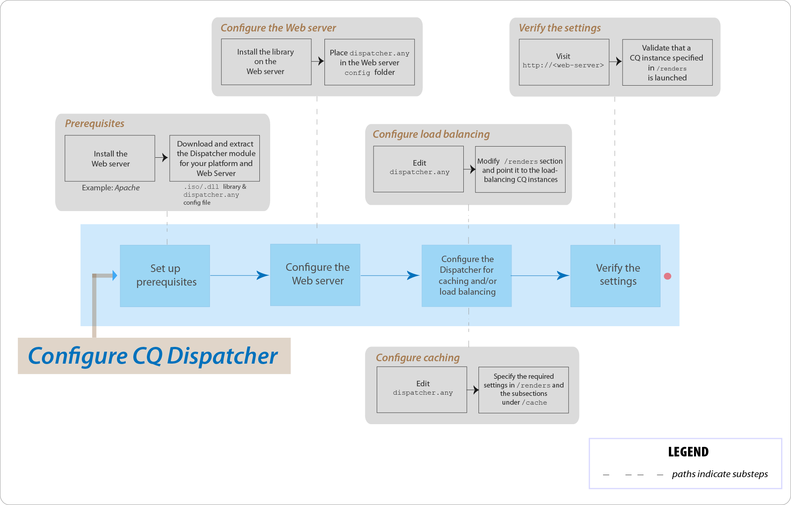

# Vanliga frågor om AEM Dispatcher



## Introduktion

### Vad är Dispatcher?

Dispatcher är Adobe Experience Managers verktyg för cachelagring och/eller belastningsutjämning som gör att du kan skapa en snabb och dynamisk webbmiljö. För cachelagring fungerar Dispatcher som en del av en HTTP-server, t.ex. Apache, i syfte att lagra (eller &quot;cachelagra&quot;) så mycket som möjligt av det statiska webbplatsinnehållet och så sällan som möjligt komma åt webbplatsens layoutmotor. I en belastningsutjämningsroll distribuerar Dispatcher användarförfrågningar (inläsning) mellan olika AEM-instanser (återgivningar).

För cachelagring använder modulen Dispatcher webbserverns förmåga att hantera statiskt innehåll. Dispatcher placerar de cachelagrade dokumenten i dokumentroten på webbservern.

### Hur utför Dispatcher cachelagring?

Dispatcher använder webbserverns förmåga att hantera statiskt innehåll. Dispatcher lagrar cachelagrade dokument i webbserverns dokumentrot. Dispatcher har två primära metoder för att uppdatera cacheinnehållet när ändringar görs på webbplatsen.

* **Innehållsuppdateringar** tar bort sidor som har ändrats samt filer som är direkt kopplade till dem.
* **Automatisk invalidering** gör automatiskt de delar av cachen som kan vara inaktuella efter en uppdatering blir ogiltiga. Det flaggar till exempel att relevanta sidor är inaktuella, utan att något tas bort.

### Vilka är fördelarna med lastbalansering?

Belastningsutjämning distribuerar användarförfrågningar (belastning) över flera AEM-instanser. I följande lista beskrivs fördelarna med belastningsutjämning:

* **Ökad processorkraft**: I praktiken innebär det att Dispatcher delar dokumentförfrågningar mellan flera instanser av AEM. Eftersom varje instans har färre dokument att behandla har du snabbare svarstider. Dispatcher sparar intern statistik för varje dokumentkategori så att den kan beräkna inläsningen och distribuera frågorna effektivt.
* **Ökad felsäker täckning**: Om Dispatcher inte tar emot svar från en instans vidarebefordrar den automatiskt begäranden till en av de andra instanserna. Om en instans blir otillgänglig är den enda effekten en nedgång av webbplatsen, som står i proportion till den förlorade datorkraften.

>[!NOTE]
>
>Mer information finns på sidan [Dispatcher Overview](dispatcher.md)

## Installera och konfigurera

### Var hämtar jag Dispatcher-modulen från?

Du kan hämta den senaste Dispatcher-modulen från sidan [Dispatcher Release Notes](release-notes.md) .

### Hur installerar jag modulen Dispatcher?

Se sidan [Installera Dispatcher](dispatcher-install.md) .

### Hur konfigurerar jag modulen Dispatcher?

Se sidan [Konfigurera Dispatcher](dispatcher-configuration.md) .

### Hur konfigurerar jag Dispatcher för författarinstansen?

Detaljerade anvisningar finns i [Använda Dispatcher med en författarinstans](dispatcher.md#using-a-dispatcher-with-an-author-server) .

### Hur konfigurerar jag Dispatcher med flera domäner?

Du kan konfigurera CQ Dispatcher med flera domäner, förutsatt att domänerna uppfyller följande villkor:

* Webbinnehållet för båda domänerna lagras i en enda AEM-databas
* Filerna i Dispatcher-cachen kan ogiltigförklaras separat för varje domän

Läs [Använda Dispatcher med flera domäner](dispatcher-domains.md) för mer information.

### Hur konfigurerar jag Dispatcher så att alla begäranden från en användare dirigeras till samma Publish-instans?

Du kan använda funktionen för [klisterlappande anslutningar](dispatcher-configuration.md#identifying-a-sticky-connection-folder-stickyconnectionsfor) , som ser till att alla dokument för en användare bearbetas i samma instans av AEM. Den här funktionen är viktig om du använder personaliserade sidor och sessionsdata. Data lagras på instansen. Därför måste efterföljande begäranden från samma användare returnera till den instansen, annars går data förlorade.

Eftersom häftiga anslutningar begränsar Dispatcher möjlighet att optimera begäranden bör du bara använda den här metoden när det behövs. Du kan ange den mapp som innehåller de&quot;klisterlappande&quot; dokumenten, så att alla dokument i mappen behandlas på samma plats för en användare.

### Kan jag använda kladdiga anslutningar och cachelagring tillsammans?

För de flesta sidor där klisterlappande anslutningar används bör du inaktivera cachelagring. I annat fall visas samma instans av sidan för alla användare, oavsett sessionsinnehållet.

I vissa program kan du använda både fast anslutning och cachelagring. Om du till exempel visar ett formulär som skriver data till en session, kan du använda kladdiga anslutningar och cachelagring tillsammans.

### Kan en Dispatcher och en AEM Publish-instans finnas på samma fysiska dator?

Ja, om maskinen är tillräckligt kraftfull. Du bör dock konfigurera Dispatcher och AEM Publish-instansen på olika datorer.

Vanligtvis finns Publish-instansen inuti brandväggen och Dispatcher finns i DMZ. Om du väljer att ha både Publish-instansen och Dispatcher på samma fysiska dator måste du se till att brandväggsinställningarna förhindrar direktåtkomst till Publish-instansen från externa nätverk.

### Kan jag bara cachelagra filer med specifika tillägg?

Ja. Om du till exempel bara vill cachelagra GIF-filer anger du *.gif i cache-avsnittet i dispatcher.any-konfigurationsfilen.

### Hur tar jag bort filer från cachen?

Du kan ta bort filer från cachen genom att använda en HTTP-begäran. När HTTP-begäran tas emot tar Dispatcher bort filerna från cachen. Dispatcher cachelagrar filerna igen endast när de tar emot en klientbegäran för sidan. Att ta bort cachelagrade filer på det här sättet är lämpligt för webbplatser som sannolikt inte tar emot samtidiga begäranden för samma sida.

HTTP-begäran har följande syntax:

```
POST /dispatcher/invalidate.cache HTTP/1.1
CQ-Action: Activate
CQ-Handle: path-pattern
Content-Length: 0
```

Dispatcher tar bort de cachelagrade filer och mappar som har namn som matchar värdet i CQ-Handle-huvudet. En CQ-Handle med `/content/geomtrixx-outdoors/en` följande objekt matchar:

Alla filer (oavsett filtillägg) med namnet en i katalogen geometrixx-outdoorNågon katalog med namnet `_jcr_content` under katalogen en (som, om den finns, innehåller cachelagrade återgivningar av sidans undernoder)Katalogen en tas bara bort om den `CQ-Action` är `Delete` eller `Deactivate`.

Mer information om det här avsnittet finns i [Invalidera Dispatcher-cachen](page-invalidate.md)manuellt.

### Hur implementerar jag behörighetskänslig cachelagring?

Se sidan [Cachelagra säkert innehåll](permissions-cache.md) .

### Hur skyddar jag kommunikationen mellan Dispatcher- och CQ-instanserna?

Se [Dispatcher Security Checklist](security-checklist.md) och [AEM Security Checklist](https://helpx.adobe.com/experience-manager/6-4/sites/administering/using/security-checklist.html) pages.

### Skickaproblem `jcr:content` ändrat till `jcr%3acontent`

**Fråga**: Vi har nyligen stött på ett problem på dispatcher-nivå där ett av de stora anropen som hämtade data från CQ-databasen hade `jcr:content` orsakat problemet och som kodades till `jcr%3acontent` fel resultatuppsättning.

**Svar**: Använd `ResourceResolver.map()` metod för att hämta en egen URL som ska användas/utfärdas hämta begäranden från och även för att lösa cachelagringsproblemet med Dispatcher. Metoden map() kodar `:` kolon till understreck och metoden resolve() avkodar dem tillbaka till SLING JCR-läsbart format. Du måste använda metoden map() för att generera den URL som används i Ajax-anropet.

Läs mer: [https://sling.apache.org/documentation/the-sling-engine/mappings-for-resource-resolution.html#namespace-mangling](https://sling.apache.org/documentation/the-sling-engine/mappings-for-resource-resolution.html#namespace-mangling)

## Rensa Dispatcher

### Hur konfigurerar jag push-agenter för Dispatcher i en Publish-instans?

Se sidan [Replikering](https://helpx.adobe.com/content/help/en/experience-manager/6-4/sites/deploying/using/replication.html#ConfiguringyourReplicationAgents) .

### Hur felsöker jag problem med att tömma Dispatcher?

[Läs den här felsökningsartikeln](https://helpx.adobe.com/content/help/en/experience-manager/kb/troubleshooting-dispatcher-flushing-issues.html) som ger svar på följande frågor:

* Hur felsöker jag en situation där inget innehåll sparas i Dispatcher-cachen?
* Hur felsöker jag en situation där cachefiler inte uppdateras?
* Hur felsöker jag en situation där inget relaterat till Dispatcher-tömning fungerar?

Om åtgärderna Ta bort gör att Dispatcher rensas [använder du lösningen i det här community-blogginlägget av Sensei Martin](https://mkalugin-cq.blogspot.in/2012/04/i-have-been-working-on-following.html).

### Hur tömmer jag DAM-resurser från Dispatcher-cachen?

Du kan använda funktionen &quot;kedjereplikering&quot;.  När den här funktionen är aktiverad skickar dispatcherns push-agent en tömningsbegäran när en replikering tas emot från författaren.

Så här aktiverar du den:

1. [Följ stegen här](page-invalidate.md#invalidating-dispatcher-cache-from-a-publishing-instance) för att skapa tömningsagenter vid publicering
1. Gå till varje agentkonfiguration och markera kryssrutan **Vid mottagning** på fliken **Utlösare** .

## Övrigt

Hur avgör Dispatcher om ett dokument är aktuellt?
För att avgöra om ett dokument är uppdaterat utför Dispatcher följande åtgärder:

Den kontrollerar om dokumentet kan ogiltigförklaras automatiskt. Annars betraktas dokumentet som uppdaterat.
Om dokumentet har konfigurerats för automatisk ogiltigförklaring kontrollerar Dispatcher om det är äldre eller nyare än den senaste tillgängliga ändringen. Om den är äldre begär Dispatcher den aktuella versionen från AEM-instansen och ersätter versionen i cachen.

### Hur returnerar Dispatcher dokument?

Du kan definiera om Dispatcher ska cacha ett dokument med hjälp av [Dispatcher-konfigurationsfilen](dispatcher-configuration.md) `dispatcher.any`. Dispatcher kontrollerar begäran mot listan med cachelagrade dokument. Om dokumentet inte finns med i den här listan begär Dispatcher dokumentet från AEM-instansen.

Egenskapen styr `/rules` vilka dokument som cachelagras enligt dokumentsökvägen. Oavsett `/rules` egenskap cachelagras aldrig ett dokument i följande fall:

* Om URI:n för begäran innehåller ett frågetecken `(?)`.
* Detta indikerar vanligtvis en dynamisk sida, till exempel ett sökresultat som inte behöver cachas.
* Filtillägget saknas.
* Webbservern behöver tillägget för att kunna avgöra dokumenttypen (MIME-typen).
* Autentiseringshuvudet har angetts (detta kan konfigureras)
* Om AEM-instansen svarar med följande rubriker:
   * no-cache
   * no store
   * must-revalidate

Dispatcher lagrar cachelagrade filer på webbservern som om de var en del av en statisk webbplats. Om en användare begär ett cachelagrat dokument kontrollerar Dispatcher om dokumentet finns i webbserverns filsystem. I så fall returnerar Dispatcher dokumenten. Annars begär Dispatcher dokumentet från AEM-instansen.

>[!NOTE]
>
>Metoderna GET eller HEAD (för HTTP-huvudet) kan nås av Dispatcher. Mer information om cachelagring av svarshuvuden finns i avsnittet [Cachelagra HTTP-svarshuvuden](dispatcher-configuration.md#caching-http-response-headers) .

### Kan jag implementera flera utskickare i en konfiguration?

Ja. I så fall måste du se till att båda utskickarna har direktåtkomst till AEM-webbplatsen. En Dispatcher kan inte hantera begäranden från en annan Dispatcher.

