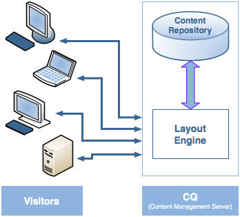
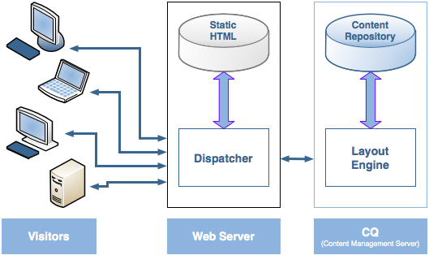
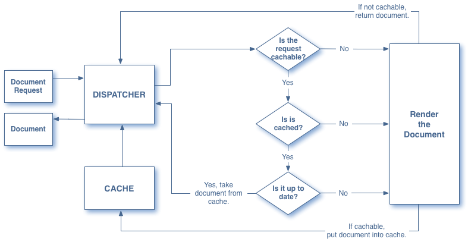
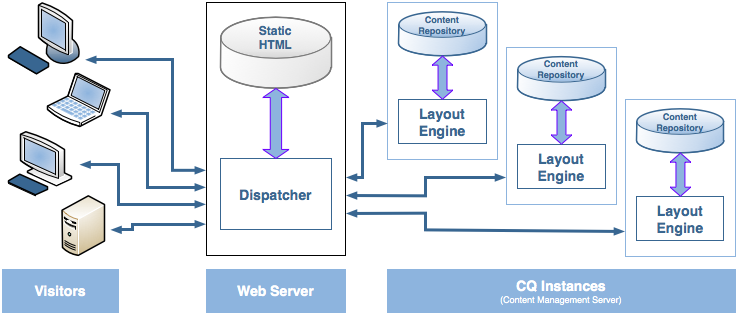

# Dispatcher-översikt {#dispatcher-overview}

>[!NOTE]
>
>Dispatcher-versionerna är oberoende av AEM. Du kan ha omdirigerats till den här sidan om du har följt en länk till Dispatcher-dokumentationen som är inbäddad i dokumentationen för en tidigare version av AEM.

Dispatcher är ett Adobe Experience Manager verktyg för cachelagring och/eller belastningsutjämning som kan användas tillsammans med en webbserver i företagsklass.

Processen för att distribuera dispatcher är oberoende av webbservern och den OS-plattform som valts:

1. Läs mer om Dispatcher (den här sidan). Se även [Vanliga frågor om dispatcher](https://helpx.adobe.com/experience-manager/using/dispatcher-faq.html).
1. Installera en [webbserver](https://helpx.adobe.com/experience-manager/6-3/sites/deploying/using/technical-requirements.html) som stöds enligt webbserverdokumentationen.
1. [Installera Dispatcher-](dispatcher-install.md) modulen på webbservern och konfigurera webbservern därefter.
1. [Konfigurera Dispatcher](dispatcher-configuration.md)  (filen dispatcher.any).
1. [Konfigurera ](page-invalidate.md) AEM så att innehållsuppdateringar gör cachen ogiltig.

>[!NOTE]
>
>Så här får du en bättre förståelse för hur Dispatcher fungerar med AEM:
>
>* Se [Fråga de AEM experterna i communityn i juli 2017](https://bit.ly/ATACE0717).
>* Åtkomst till [den här databasen](https://github.com/adobe/aem-dispatcher-experiments). Den innehåller en samling experiment i ett&quot;start-home&quot;-laboratorieformat.


Använd följande information efter behov:

* [Checklistan för Dispatcher-säkerhet](security-checklist.md)
* [Dispatcher Knowledge Base](https://helpx.adobe.com/cq/kb/index/dispatcher.html)
* [Optimera en webbplats för cacheprestanda](https://helpx.adobe.com/experience-manager/6-4/sites/deploying/using/configuring-performance.html)
* [Använda Dispatcher med flera domäner](dispatcher-domains.md)
* [Använda SSL med Dispatcher](dispatcher-ssl.md)
* [Implementera behörighetskänslig cachelagring](permissions-cache.md)
* [Felsökning av Dispatcher-problem](dispatcher-troubleshooting.md)
* [Vanliga frågor och svar om Dispatcher](dispatcher-faq.md)

>[!NOTE]
>
>******Det vanligaste användningsområdet för Dispatcher är att cachelagra svar från en AEM-publiceringsinstans** för att minska svarstiden och öka säkerheten för den externt adresserade publicerade webbplatsen. Det mesta av diskussionen fokuserar på detta fall.
>
>Men Dispatcher kan också användas för att öka svarstiden för **författarinstansen**, särskilt om du har ett stort antal användare som redigerar och uppdaterar webbplatsen. Mer information om detta fall finns i [Använda en Dispatcher med en Author Server](#using-a-dispatcher-with-an-author-server) nedan.

## Varför ska jag använda Dispatcher för att implementera Caching? {#why-use-dispatcher-to-implement-caching}

Det finns två grundläggande strategier för webbpublicering:

* **Statiska webbservrar**: som Apache eller IIS är mycket enkla, men snabba.
* **Content Management-servrar**: som ger dynamiskt, intelligent innehåll i realtid, men som kräver mycket mer beräkningstid och andra resurser.

Dispatcher hjälper till att förverkliga en miljö som är både snabb och dynamisk. Den fungerar som en del av en statisk HTML-server, som Apache, med syftet att:

* lagra (eller&quot;cachelagra&quot;) så mycket som möjligt av webbplatsinnehållet i form av en statisk webbplats
* så lite som möjligt med åtkomst till layoutmotorn.

Detta innebär att

* **statiskt** innehåll som hanteras med exakt samma hastighet och enkelhet som på en statisk webbserver. *Dessutom kan du använda de administrations- och säkerhetsverktyg som är tillgängliga för statiska webbservrar*.

* **dynamiskt** innehåll genereras efter behov, utan att systemet blir långsammare än vad som är absolut nödvändigt.

Dispatcher innehåller mekanismer för att generera och uppdatera statisk HTML baserat på innehållet på den dynamiska platsen. Du kan ange i detalj vilka dokument som lagras som statiska filer och som alltid genereras dynamiskt.

I det här avsnittet illustreras principerna bakom detta.

### Statisk webbserver {#static-web-server}


En statisk webbserver, som Apache eller IIS, skickar statiska HTML-filer till besökare på webbplatsen. Statiska sidor skapas en gång, så samma innehåll levereras för varje begäran.

Denna process är mycket enkel och därmed extremt effektiv. Om en besökare begär en fil (t.ex. en HTML-sida) hämtas filen vanligtvis direkt från minnet, och i värsta fall läses den från den lokala enheten. Statiska webbservrar har varit tillgängliga under en lång tid, så det finns ett brett utbud av verktyg för administration och säkerhetshantering, och de är mycket väl integrerade med nätverksinfrastrukturer.

### Content Management-servrar {#content-management-servers}



Om du använder en Content Management Server, till exempel AEM, bearbetar en avancerad layoutmotor en begäran från en besökare. Motorn läser innehåll från en databas som tillsammans med format, format och åtkomsträttigheter omvandlar innehållet till ett dokument som är anpassat efter besökarens behov och rättigheter.

På så sätt kan du skapa mer omfattande, dynamiskt innehåll, vilket ökar flexibiliteten och funktionaliteten på webbplatsen. Layoutmotorn kräver dock mer bearbetningskraft än en statisk server, så den här konfigurationen kan försämras om många besökare använder systemet.

## Hur Dispatcher utför cachelagring {#how-dispatcher-performs-caching}



**Cachekatalogen** För cachning använder modulen Dispatcher webbserverns förmåga att hantera statiskt innehåll. Dispatcher placerar de cachelagrade dokumenten i dokumentroten på webbservern.

>[!NOTE]
>
>Om konfigurationen för HTTP Header Caching saknas lagrar Dispatcher bara sidans HTML-kod - den lagrar inte HTTP-rubrikerna. Detta kan vara ett problem om du använder olika kodningar på webbplatsen, eftersom dessa kan gå förlorade. Information om hur du aktiverar cachelagring av HTTP-huvuden finns i [Konfigurera Dispatcher-cachen.](https://helpx.adobe.com/experience-manager/dispatcher/using/dispatcher-configuration.html)

>[!NOTE]
>
>Om du hittar dokumentroten på webbservern i nätverksansluten lagring (NAS) försämras prestandan. När en dokumentrot som finns på NAS delas mellan flera webbservrar kan dessutom intermittenta lås inträffa när replikeringsåtgärder utförs.

>[!NOTE]
>
>Dispatcher lagrar det cachelagrade dokumentet i en struktur som motsvarar den begärda URL:en.
>
>Det kan finnas begränsningar på operativsystemsnivå för filnamnets längd; d.v.s. om du har en URL med många väljare.

### Metoder för cachelagring

Dispatcher har två primära metoder för att uppdatera cacheinnehållet när ändringar görs på webbplatsen.

* **Innehållsuppdateringar** tar bort sidor som har ändrats samt filer som är direkt kopplade till dem.
* **Automatisk** invalidering gör automatiskt de delar av cachen som kan vara inaktuella efter en uppdatering ogiltiga. Det innebär att relevanta sidor flaggas som inaktuella, utan att något tas bort.

### Innehållsuppdateringar

I en innehållsuppdatering ändras ett eller flera AEM dokument. AEM skickar en syndikeringsbegäran till Dispatcher, som uppdaterar cachen enligt detta:

1. Den tar bort de ändrade filerna från cachen.
1. Den tar bort alla filer som börjar med samma referens från cachen. Om till exempel filen /en/index.html uppdateras, kommer alla filer som börjar med /en/index. tas bort. Med den här funktionen kan du utforma cacheeffektiva webbplatser, särskilt när det gäller bildnavigering.
1. Den *rör* den så kallade **statfile**; Detta uppdaterar tidsstämpeln för statusfilen för att ange datumet för den senaste ändringen.

Följande punkter bör noteras:

* Innehållsuppdateringar används vanligtvis tillsammans med ett redigeringssystem som&quot;vet&quot; vad som måste ersättas.
* Filer som påverkas av en innehållsuppdatering tas bort, men ersätts inte omedelbart. Nästa gång en sådan fil begärs hämtar Dispatcher den nya filen från AEM och placerar den i cachen, vilket skriver över det gamla innehållet.
* Vanligtvis lagras automatiskt genererade bilder som innehåller text från en sida i bildfiler som börjar med samma handtag, vilket säkerställer att kopplingen finns för borttagning. Du kan till exempel lagra titeltexten för sidan mypage.html som bilden mypage.titlePicture.gif i samma mapp. På så sätt tas bilden automatiskt bort från cacheminnet varje gång sidan uppdateras, så att du kan vara säker på att bilden alltid återspeglar den aktuella versionen av sidan.
* Du kan ha flera statusfiler, till exempel en per språkmapp. Om en sida uppdateras söker AEM efter nästa överordnade mapp som innehåller en statusfil och *söker efter den filen.*

### Automatisk ogiltigförklaring

Automatisk ogiltigförklaring gör automatiskt att delar av cacheminnet blir ogiltiga - utan att några filer tas bort fysiskt. Vid varje innehållsuppdatering ändras den s.k. statusfilen så att tidsstämpeln återspeglar den senaste innehållsuppdateringen.

Dispatcher har en lista över filer som kan ogiltigförklaras automatiskt. När ett dokument från den listan begärs jämför Dispatcher datumet för det cachelagrade dokumentet med statusfilens tidsstämpel:

* om det cachelagrade dokumentet är nyare returneras det av Dispatcher.
* om den är äldre hämtar Dispatcher den aktuella versionen från AEM.

Även här bör vissa punkter noteras:

* Automatisk ogiltigförklaring används vanligtvis när de inbördes relationerna är komplexa, t.ex. för HTML-sidor. Dessa sidor innehåller länkar och navigeringsposter, så de måste vanligtvis uppdateras efter en innehållsuppdatering. Om du har skapat PDF- eller bildfiler automatiskt kan du välja att göra även dessa ogiltiga automatiskt.
* Automatisk ogiltigförklaring innebär inte någon åtgärd från avsändaren vid uppdateringstidpunkten, med undantag för att beröra statusfilen. Om du däremot rör vid statyfilen blir cacheinnehållet föråldrat automatiskt, utan att det tas bort fysiskt från cachen.

## Hur Dispatcher returnerar dokument {#how-dispatcher-returns-documents}



### Bestämma om ett dokument ska cachelagras

Du kan [definiera vilka dokument som Dispatcher cachelagrar i konfigurationsfilen](https://helpx.adobe.com/experience-manager/dispatcher/using/dispatcher-configuration.html). Dispatcher kontrollerar begäran mot listan med cachelagrade dokument. Om dokumentet inte finns med i den här listan begär Dispatcher dokumentet från AEM.

Dispatcher *always* begär alltid dokumentet direkt från AEM i följande fall:

* Om URI:n för begäran innehåller frågetecknet &quot;?&quot;. Detta indikerar vanligtvis en dynamisk sida, till exempel ett sökresultat, som inte behöver cachas.
* Filtillägget saknas. Webbservern behöver tillägget för att kunna avgöra dokumenttypen (MIME-typen).
* Autentiseringshuvudet har angetts (detta kan konfigureras)

>[!NOTE]
>
>Metoderna GET eller HEAD (för HTTP-huvudet) kan nås av Dispatcher. Mer information om cachelagring av svarshuvuden finns i avsnittet [Caching HTTP Response Headers](https://helpx.adobe.com/experience-manager/dispatcher/using/dispatcher-configuration.html).

### Bestämma om ett dokument cache-lagras

Dispatcher lagrar de cachelagrade filerna på webbservern som om de vore en del av en statisk webbplats. Om en användare begär ett cachelagrat dokument kontrollerar Dispatcher om dokumentet finns i webbserverns filsystem:

* om dokumentet är cache-lagrat, returnerar Dispatcher filen.
* om det inte cache-lagras begär Dispatcher dokumentet från AEM.

### Bestämma om ett dokument är aktuellt

För att ta reda på om ett dokument är uppdaterat utför Dispatcher två steg:

1. Den kontrollerar om dokumentet kan ogiltigförklaras automatiskt. Annars betraktas dokumentet som uppdaterat.
1. Om dokumentet har konfigurerats för automatisk ogiltigförklaring kontrollerar Dispatcher om det är äldre eller nyare än den senaste tillgängliga ändringen. Om den är äldre begär Dispatcher den aktuella versionen från AEM och ersätter versionen i cachen.

>[!NOTE]
>
>Dokument utan **automatisk ogiltigförklaring** finns kvar i cachen tills de tas bort fysiskt. t.ex. genom en innehållsuppdatering på webbplatsen.

## Fördelarna med belastningsutjämning {#the-benefits-of-load-balancing}

Belastningsutjämning innebär att distribuera webbplatsens beräknade belastning till flera instanser av AEM.



Du vinner:

* **ökad**
bearbetningskraftI praktiken innebär detta att Dispatcher delar dokumentbegäranden mellan flera instanser av AEM. Eftersom varje instans nu har färre dokument att behandla har du snabbare svarstider. Dispatcher sparar intern statistik för varje dokumentkategori så att den kan beräkna inläsningen och distribuera frågorna effektivt.

* **ökad felsäker**
täckningOm Dispatcher inte får svar från en instans vidarebefordrar den automatiskt begäranden till en av de andra instanserna. Om en instans blir otillgänglig är den enda effekten en nedgång av webbplatsen, som står i proportion till den förlorade datorkraften. Alla tjänster kommer dock att fortsätta.

* du kan också hantera olika webbplatser på samma statiska webbserver.

>[!NOTE]
>
>Belastningsutjämningen sprider belastningen effektivt, men cachelagring bidrar till att minska belastningen. Försök därför att optimera cachning och minska den totala belastningen innan du konfigurerar belastningsutjämning. Bra cachelagring kan öka belastningsutjämnarens prestanda eller återge onödig belastningsutjämning.

>[!CAUTION]
>
>Även om en enskild Dispatcher vanligtvis kan mätta kapaciteten för de tillgängliga Publish-instanserna, kan det för vissa sällsynta program vara vettigt att ytterligare balansera belastningen mellan två Dispatcher-instanser. Konfigurationer med flera utskickare måste övervägas noggrant eftersom en ytterligare utskickare ökar belastningen på de tillgängliga publiceringsinstanserna och kan enkelt minska prestandan i de flesta program.

## Så här utför Dispatcher belastningsutjämning {#how-the-dispatcher-performs-load-balancing}

### Prestandastatistik

Dispatcher lagrar intern statistik om hur snabbt varje instans av AEM bearbetar dokument. Utifrån dessa data uppskattar Dispatcher vilken instans som ger den snabbaste svarstiden när en begäran besvaras, och reserverar därför den nödvändiga beräkningstiden för den instansen.

Olika typer av förfrågningar kan ha olika genomsnittliga slutförandetider, så med Dispatcher kan du ange dokumentkategorier. Dessa beaktas sedan när tidsberäkningarna beräknas. Du kan till exempel skilja mellan HTML-sidor och bilder, eftersom svarstiderna ofta är olika.

Om du använder en avancerad sökfunktion kan du skapa en ny kategori för sökfrågor. Detta gör att Dispatcher kan skicka sökfrågor till den instans som svarar snabbast. Detta förhindrar att en långsammare instans slingrar sig när den tar emot flera&quot;dyra&quot; sökfrågor, medan de andra får de&quot;billigare&quot; förfrågningarna.

### Personaliserat innehåll (Sticky Connections)

Med fästiga anslutningar säkerställs att dokument för en användare består av samma instans av AEM. Detta är viktigt om du använder personaliserade sidor och sessionsdata. Data lagras på instansen, så efterföljande förfrågningar från samma användare måste returnera till instansen annars går data förlorade.

Eftersom häftiga anslutningar begränsar Dispatcher möjlighet att optimera förfrågningar bör du bara använda dem när det behövs. Du kan ange den mapp som innehåller de&quot;klisterlappande&quot; dokumenten, så att alla dokument i mappen är sammansatta på samma instans för varje användare.

>[!NOTE]
>
>För de flesta sidor som använder klisterlappande anslutningar måste du stänga av cachelagring, annars ser sidan likadan ut för alla användare, oavsett sessionsinnehåll.
>
>För ett *fåtal*-program kan du använda både klibbiga anslutningar och cachelagring. Om du till exempel visar ett formulär som skriver data till sessionen.

## Använda flera utskickare {#using-multiple-dispatchers}

I komplexa inställningar kan du använda flera Dispatcher. Du kan till exempel använda:

* en Dispatcher för att publicera en webbplats på intranätet
* en andra Dispatcher, under en annan adress och med olika säkerhetsinställningar, för att publicera samma innehåll på Internet.

I så fall måste du se till att varje begäran endast går igenom en Dispatcher. En Dispatcher hanterar inte begäranden som kommer från en annan Dispatcher. Kontrollera därför att båda utskickarna har direktåtkomst till den AEM webbplatsen.

## Använda Dispatcher med ett CDN {#using-dispatcher-with-a-cdn}

Ett leveransnätverk (CDN), som Akamai Edge Delivery eller Amazon Cloud Front, levererar innehåll från en plats nära slutanvändaren. På det viset

* snabbar upp svarstiderna för slutanvändare
* tar fart på dina servrar

Som en HTTP-infrastrukturkomponent fungerar ett CDN ungefär som Dispatcher: När en CDN-nod tar emot en begäran, skickas begäran från dess cache om det är möjligt (resursen finns i cachen och är giltig). Annars kommer den till nästa närmaste server för att hämta resursen och cachelagra den för ytterligare begäranden om det behövs.

Nästa närmaste server beror på din konfiguration. I en Akamai-konfiguration kan begäran till exempel ha följande sökväg:

* The Akamai Edge Node
* Akamai Midgres Layer
* Din brandvägg
* Din belastningsutjämnare
* Dispatcher
* AEM

I de flesta fall är Dispatcher nästa server som kan hantera dokumentet från en cache och påverka de svarshuvuden som returneras till CDN-servern.

## Kontrollera ett CDN-cacheminne {#controlling-a-cdn-cache}

Det finns ett antal sätt att styra hur länge ett CDN ska cachelagra en resurs innan den hämtas igen från Dispatcher.

1. Explicit konfiguration\
   Konfigurera, hur länge särskilda resurser ska hållas i CDN:ens cache, beroende på MIME-typ, tillägg, typ av begäran osv.

1. Rubriker för förfallodatum och cachekontroll\
   De flesta CDN:er respekterar `Expires:` och `Cache-Control:` HTTP-huvuden om de skickas av den överordnade servern. Detta kan uppnås t.ex. genom att använda modulen [mod_expirres](https://httpd.apache.org/docs/2.4/mod/mod_expires.html) Apache.

1. Manuell ogiltigförklaring\
   Med CDN:er kan resurser tas bort från cachen via webbgränssnitt.
1. API-baserad ogiltigförklaring\
   De flesta CDN:er har också ett REST- och/eller SOAP-API som gör att resurser kan tas bort från cachen.

I en typisk AEM ger konfiguration via tillägg och/eller sökväg, som kan uppnås med punkterna 1 och 2 ovan, möjlighet att ange rimliga cachelagringsperioder för resurser som används ofta och som inte ändras så ofta, till exempel designbilder och klientbibliotek. När nya versioner distribueras krävs vanligtvis en manuell ogiltigförklaring.

Om den här metoden används för att cachelagra hanterat innehåll innebär det att innehållsändringar endast är synliga för slutanvändarna när den konfigurerade cachelagringsperioden har gått ut och dokumentet hämtas från Dispatcher igen.

Om du vill ha mer detaljerad kontroll kan du med API-baserad ogiltigförklaring ogiltigförklara ett CDN-cacheminne när Dispatcher-cachen ogiltigförklaras. Baserat på CDN:er-API:t kan du implementera en egen [ContentBuilder](https://helpx.adobe.com/experience-manager/6-5/sites/developing/using/reference-materials/javadoc/com/day/cq/replication/ContentBuilder.html) och [TransportHandler](https://helpx.adobe.com/experience-manager/6-5/sites/developing/using/reference-materials/javadoc/com/day/cq/replication/TransportHandler.html) (om API:t inte är REST-baserad) och konfigurera en replikeringsagent som använder dessa för att göra CDN:ns cache ogiltig.

>[!NOTE]
>
>Se även [AEM (CQ) Dispatcher Security och CDN+Browser Caching](https://www.slideshare.net/andrewmkhoury/dispatcher-caching-aemgemspart2jan2015) och inspelad presentation [Dispatcher Caching](https://docs.adobe.com/content/ddc/en/gems/dispatcher-caching---new-features-and-optimizations.html).

## Använda en Dispatcher med en författarserver {#using-a-dispatcher-with-an-author-server}

>[!CAUTION]
>
>om du använder [AEM med Touch UI](https://helpx.adobe.com/experience-manager/6-3/sites/developing/using/touch-ui-concepts.html) ska du **inte** cachelagra författarinstansinnehåll. Om cachelagring aktiverades för författarinstansen måste du inaktivera den och ta bort innehållet i cachekatalogen. Om du vill inaktivera cachelagring bör du redigera filen `author_dispatcher.any` och ändra egenskapen `/rule` i `/cache`-avsnittet enligt följande:

```xml
/rules
{
/0000
{ /type "deny" /glob "*"}
}
```

En Dispatcher kan användas framför en författarinstans för att förbättra redigeringsprestanda. Så här konfigurerar du en Dispatcher för redigering:

1. Installera en Dispatcher på en webbserver (detta kan vara Apache eller IIS-webbserver, se [Installera Dispatcher](dispatcher-install.md)).
1. Du kanske vill testa den nyligen installerade Dispatcher mot en fungerande AEM-publiceringsinstans för att se till att rätt installation har nåtts.
1. Kontrollera nu att Dispatcher kan ansluta via TCP/IP till din författarinstans.
1. Ersätt exempelfilen dispatcher.any med filen author_dispatcher.any som finns i [Dispatcher Download](release-notes.md#downloads).
1. Öppna `author_dispatcher.any` i en textredigerare och gör följande ändringar:

   1. Ändra `/hostname` och `/port` för `/renders`-avsnittet så att det pekar på författarinstansen.
   1. Ändra `/docroot` för `/cache`-avsnittet så att det pekar på en cachekatalog. Om du använder [AEM med Touch UI](https://helpx.adobe.com/experience-manager/6-3/sites/developing/using/touch-ui-concepts.html) ska du läsa varningen ovan.
   1. Spara ändringarna.

1. Ta bort alla befintliga filer i katalogen `/cache` > `/docroot` som du konfigurerade ovan.
1. Starta om webbservern.

>[!NOTE]
>
>Observera att när du installerar ett CQ5-funktionspaket, snabbkorrigering eller programkodpaket som påverkar innehåll under `/libs` eller `/apps` med den angivna `author_dispatcher.any`-konfigurationen måste du ta bort de cachelagrade filerna under dessa kataloger i din dispatcher-cache för att säkerställa att de nyuppgraderade filerna hämtas nästa gång de begärs, och inte de gamla cachelagrade filerna.

>[!CAUTION]
>
>Om du har använt den tidigare konfigurerade författardispatchern och aktiverat en *dispatcher flushing Agent* gör du följande:

1. Ta bort eller inaktivera **författardispatcherens** flushagent på AEM författarinstans.
1. Gör om konfigurationen av författardispatchern genom att följa de nya instruktionerna ovan.

<!--
[Author Dispatcher configuration file (Dispatcher 4.1.2 or later)](assets/author_dispatchernew.any)
-->
<!--[!NOTE]
>
>A related knowledge base article can be found here:  
>[How to configure the dispatcher in front of an authoring environment](https://helpx.adobe.com/cq/kb/HowToConfigureDispatcherForAuthoringEnvironment.html)
-->
